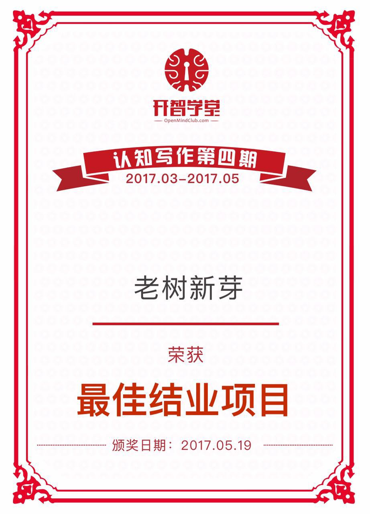

## 项目概述

### 项目简介

“老树新芽”是一个专为老人打造的故事传播平台，每天推荐老年乐趣、青春激情、家庭温暖等老人真实优质的人生故事。除了听故事，老人还可以分享自己的人生经历，支持文字或语音输入，轻松识别多种方言。老树新芽帮老人打破“老了不中用”的禁锢，提倡像年轻人一样想做就做，主动发现和创造生活乐趣；为年轻人提供了解老人的窗口增进两代人的情感联结。

### 项目资料
* 项目仓库地址：https://github.com/Mina-yy/BPstory
* 百度云视频地址：链接: https://pan.baidu.com/s/1o8yRmmI 密码: d283
* 腾讯视频地址：https://v.qq.com/x/page/n0503hmubaa.html (为了获得最佳观影体验 请狂击超清）
* 项目路演：
	* [路演文稿（全）](BP路演文稿(全).pdf) 
	* [路演Q&A](170514老树新芽路演Q&A.md)
* 项目总结：https://github.com/Mina-yy/BPstory/issues/12

### 团队成员介绍

* 菟葵+Mina-yy+[仓库](https://github.com/Mina-yy)

* 菟葵，互联网非专业项目经理，不正经程序媛，没吃过产品设计和商业模式的猪肉，但见过猪跑，能提供相关外援咨询。喜欢画画、跳舞、做手工，也涉猎健身和普拉提。擅长逻辑分析、多任务管理。BP过程中需要什么都可以现学现卖，抱着解锁新技能的态度希望和大家好好玩，99.9%投入度，一起做一款有故事的BP。

* 李星星+lucy201703+[仓库](https://github.com/lucy201703)

* 李星星，英语翻硕学渣，职场菜鸟。倾听者、正能量传播者、伪文青，一个独立理性又感性的女侠，迷茫而义无反顾地踏上寻找生命惊喜的征程，以匠人的姿态追随内心的喜悦与满足。

* 阿杰+jason2960+[仓库](https://github.com/jason2960)

* 刘杰，走在马拉松、读书、写作路上的药物研发工程师。在马拉松的赛道上挑战自我，于书籍的静谧里寻找智慧，在光影的色彩里体验生命，在科研的世界里探索真理。终身学习是一生的志业。期待在未来能用文字去分享生命，影响生命。

### 项目成果

